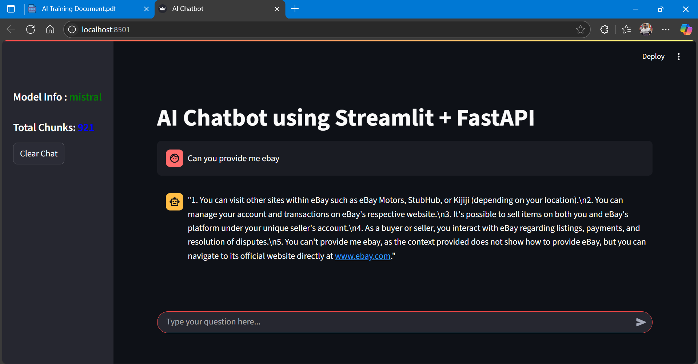
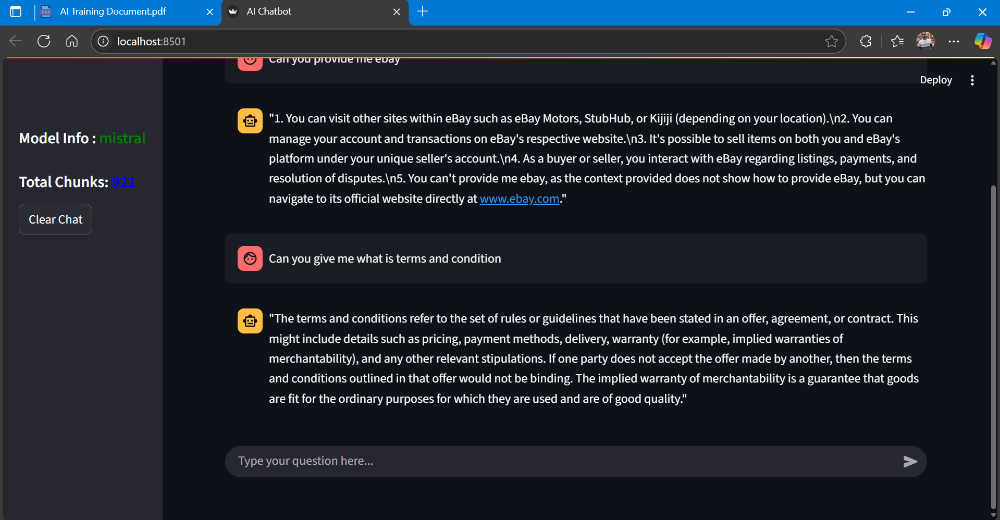
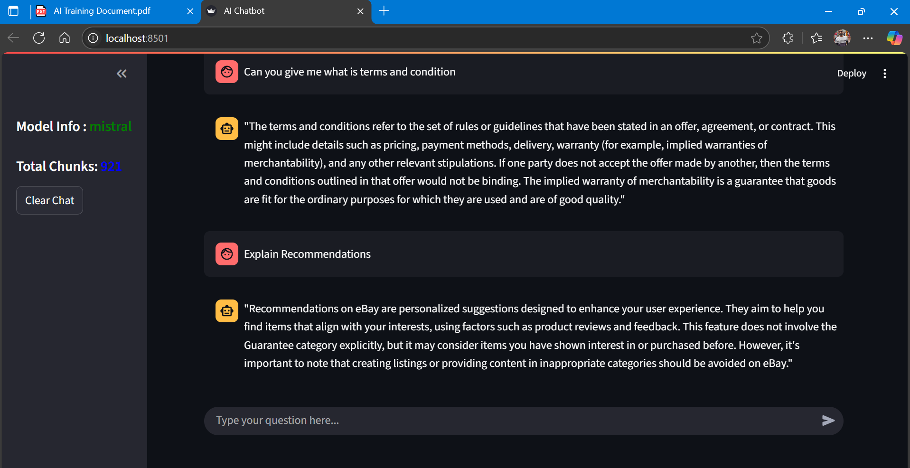
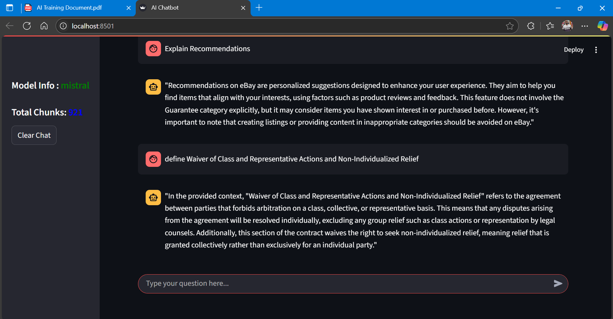
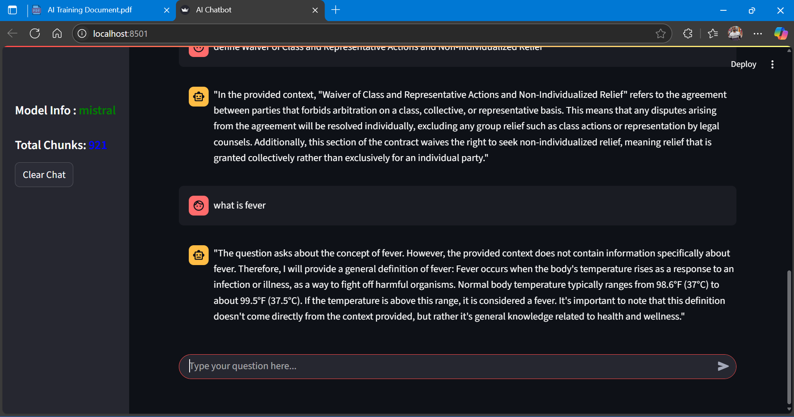

🧠 AI ChatBot using Faiss, FastAPI, Streamlit, LangChain & Mistral

Welcome to the AI ChatBot project!

**Overview** :

    - This project implements a Retrieval-Augmented Generation (RAG) chatbot using the following stack:
    - Faiss: For vector storage and semantic similarity search
    - FastAPI: Backend REST API for document ingestion and query handling
    - LangChain: To orchestrate LLMs and retrieval logic
    - Mistral Model: LLM used for generating responses
    - Streamlit: Interactive UI with real-time streaming

**Features** :

🔍 Semantic search using Faiss-based vector store
⚡ FastAPI backend to serve chat responses via API
🧠 LangChain integration for prompt handling & LLM chains
🤖 Mistral model for high-quality LLM responses
🌐 Streamlit UI for user-friendly chat experience
📄 Supports PDF document ingestion and RAG (Retrieval-Augmented Generation)

**Architecture & Flow** :

    | Document Loader | --->  | Chunk Splitter  | ---> | Embedding Generator| ---> |  Faiss Vector DB |
                                                                                            |
                                                                                            v   
                |  Streamlit (Frontend)  |    <---  | Mistral + RAG  |  <--- |  FastAPI (Query Handler) | 
                                                                                                   

**Project Directory** :

    ├── AMLGO TEST/
    │         
    ├── chunks/
    │   └── index.faiss
    │   └── index.pkl     
    ├── vectordb/
    │   └── vectordb.py          
    ├── src/
    │   └── helper.py
    │   └── prompt.py         
    ├── data/
    │   └── AI Training Document.pdf          
    ├── README.md
    ├── requirements.txt
    ├── app.py
    ├── template.py

**Getting Started**

    1. Clone the repository ->  git clone https://github.com/VinayM573/Amlgo-Test.git

    2. pip install -r requirements.txt

    3. Running the Project Locally with Ollama
        3.1 Download Ollama from -> https://ollama.com/download
        3.2 Pull the Model -> ollama pull mistral

    4. Run the Backend (FastAPI) -> uvicorn app:app --reload

    5. Run the Frontend (Streamlit) -> streamlit run template.py

**Configuration** :

    - PDF documents are ingested using PyPDFLoader
    - Embeddings generated using HuggingFaceBgeEmbeddings
    - Vector store is Faiss
    - Query pipeline is based on LangChain with Retrieval-Augmented Generation
    - LLM: Mistral (local or API-integrated)

**Tech Stack** :

    | Layer      | Technology       |
    | ---------- | ---------------- |
    | LLM        | Mistral          |
    | Embeddings | HuggingFace BGE  |
    | Vector DB  | Faiss            |
    | Backend    | FastAPI          |
    | Frontend   | Streamlit        |
    | Chunking   | NLTK / LangChain |

**Project Files on Google Drive**

You can access the project files, reports, and assets from the link below:

👉 [Click here to open Google Drive folder](https://drive.google.com/file/d/19lE7vWKKT-_IfYszDNt8a7GQplgoXx08/view?usp=sharing)

**📸 Preview**

